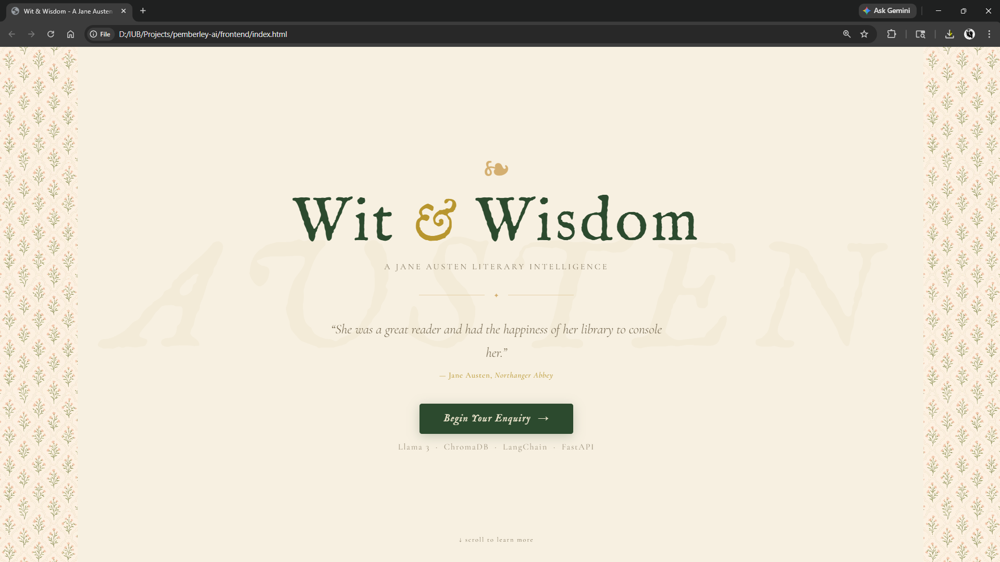
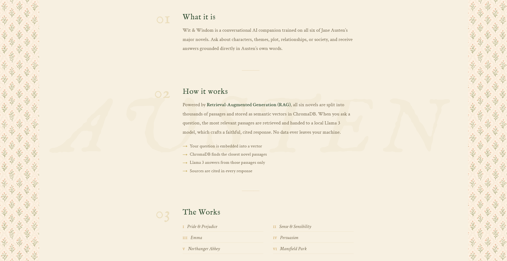
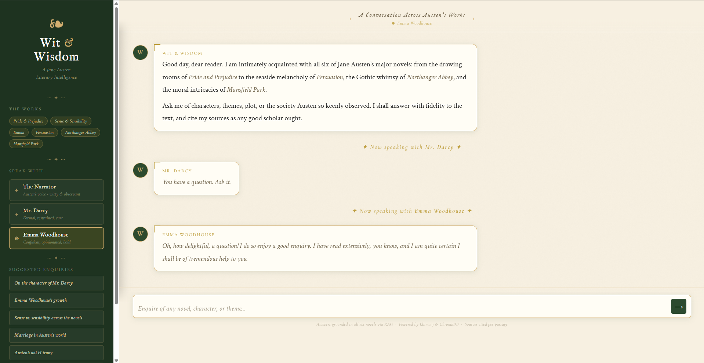
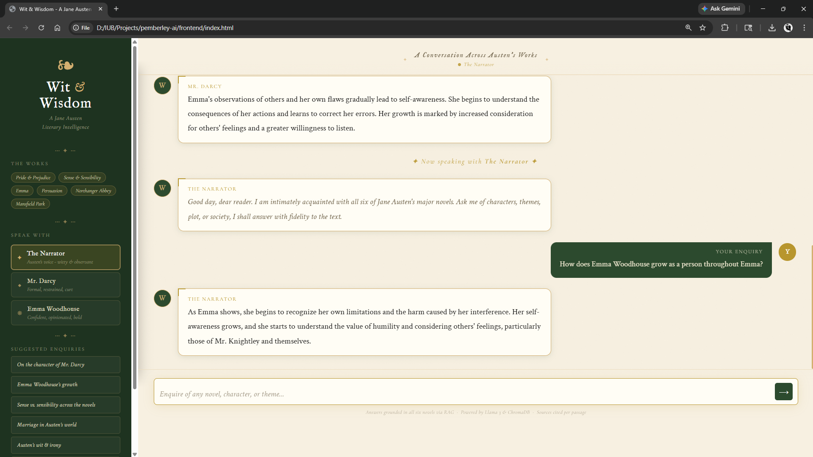
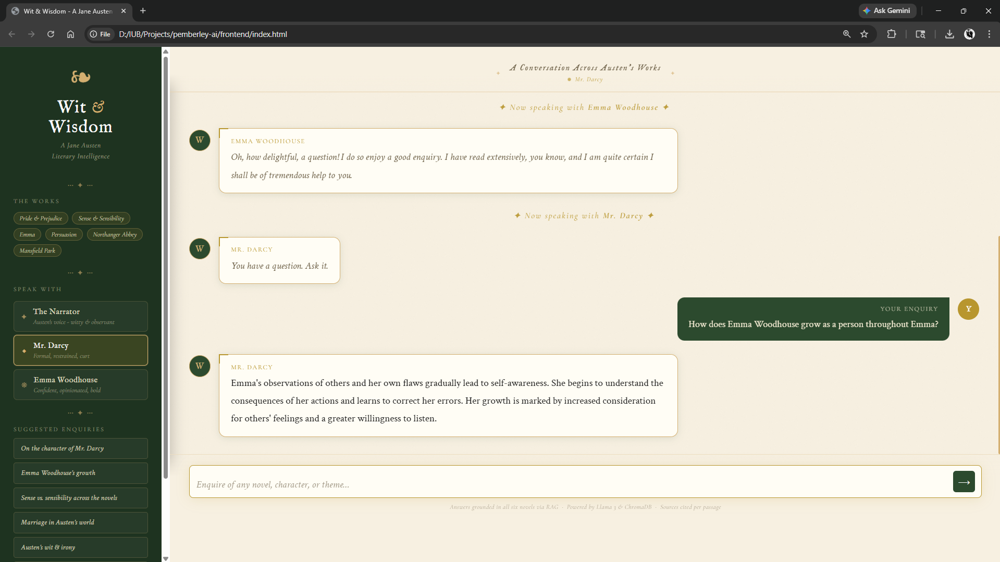
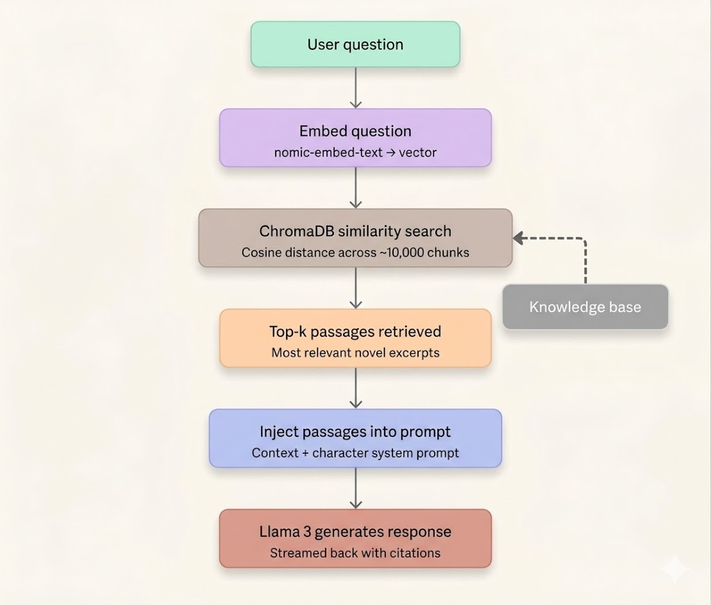

# Wit & Wisdom 
### A Jane Austen Literary Intelligence powered by RAG

Wit & Wisdom is a fully local, Retrieval-Augmented Generation (RAG) chatbot built on all six of Jane Austen's major novels: Sense and Sensibility, Pride and Prejudice, Mansfield Park, Emma, Northanger Abbey, and Persuasion. Ask it anything about characters, themes, plot, or society and receive answers grounded directly in the text, with citations.

### Landing Page



### Chat - Modes


### Chat - The Narrator


### Chat - Mr. Darcy



---

## Features

- **RAG Architecture** - answers are retrieved from the actual novels, not generated from memory. Every response is grounded in real passages.
- **Character Modes** - switch between three distinct voices:
  - *The Narrator* - Austen's witty, observant narrative voice
  - *Mr. Darcy* - formal, restrained, curt
  - *Emma Woodhouse* - confident, opinionated, occasionally misguided
- **All Six Novels** - Pride & Prejudice, Sense & Sensibility, Emma, Persuasion, Northanger Abbey, Mansfield Park
- **Fully Local** - runs entirely on your machine via Ollama. 
- **Streaming Responses** - text streams in real time as the model generates it
- **Source Citations** - every response cites which novel the passage came from
- **Regency-era UI** - custom frontend with floral accents, parchment tones, and period-appropriate typography

---

## Tech Stack

| Layer | Technology |
|---|---|
| LLM | Llama 3 (8B) via Ollama |
| Embeddings | nomic-embed-text via Ollama |
| Vector Store | ChromaDB (local, persistent) |
| Orchestration | LangChain (LCEL) |
| Backend | FastAPI + Python 3.9 |
| Frontend | HTML / CSS / JS |

---

## Architecture


---

## Getting Started

### Prerequisites

- Python 3.9–3.12
- [Ollama](https://ollama.com) installed and running

### 1. Clone the repo

```bash
git clone https://github.com/MerylJacob/wit-and-wisdom.git
cd wit-and-wisdom
```

### 2. Pull the models

```bash
ollama pull llama3
ollama pull nomic-embed-text
```

### 3. Set up the Python environment

```bash
cd backend
python -m venv venv

# Windows
venv\Scripts\activate

# Mac/Linux
source venv/bin/activate

pip install -r requirements.txt
```

### 4. Ingest the novels 

This downloads all six novels from Project Gutenberg and builds the vector store.

```bash
python -m app.ingest
```

### 5. Start the API server

```bash
uvicorn app.main:app --reload --port 8000
```

### 6. Open the frontend

Serve the frontend locally:

```bash
cd ../frontend
python -m http.server 3000
```

Then open [http://localhost:3000](http://localhost:3000) in your browser.

---

## API

### `POST /chat`

```json
{
  "question": "What is Mr. Darcy's first impression of Elizabeth?",
  "character": "darcy"
}
```

**Characters:** `austen` | `darcy` | `emma`

**Response:** Plain text stream

### `GET /health`

Returns server status and loaded novels.

---

## License

The texts of Jane Austen's novels are in the public domain via [Project Gutenberg](https://www.gutenberg.org).
